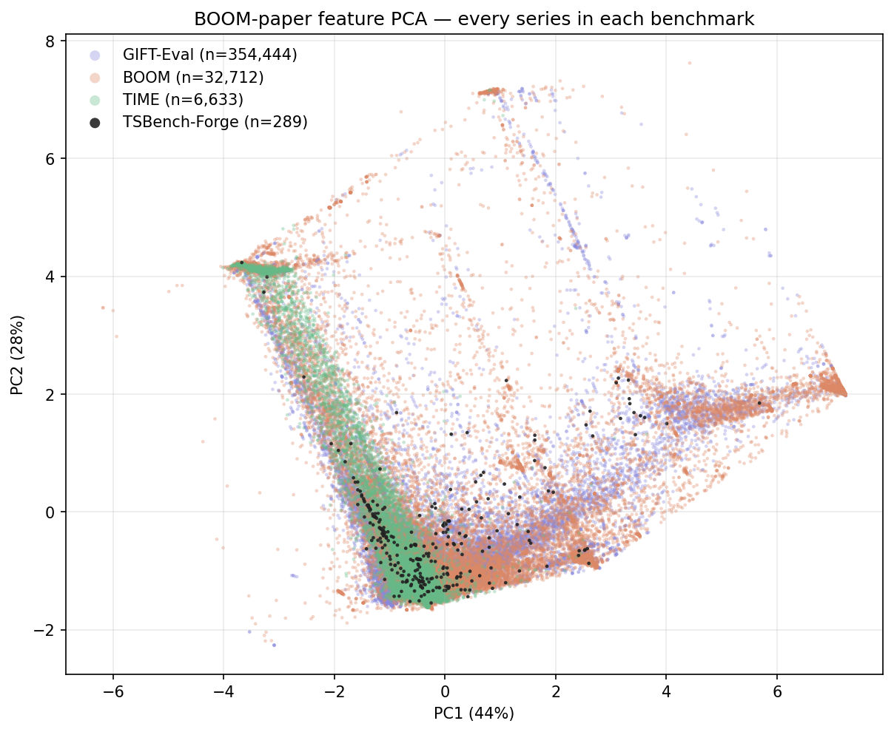
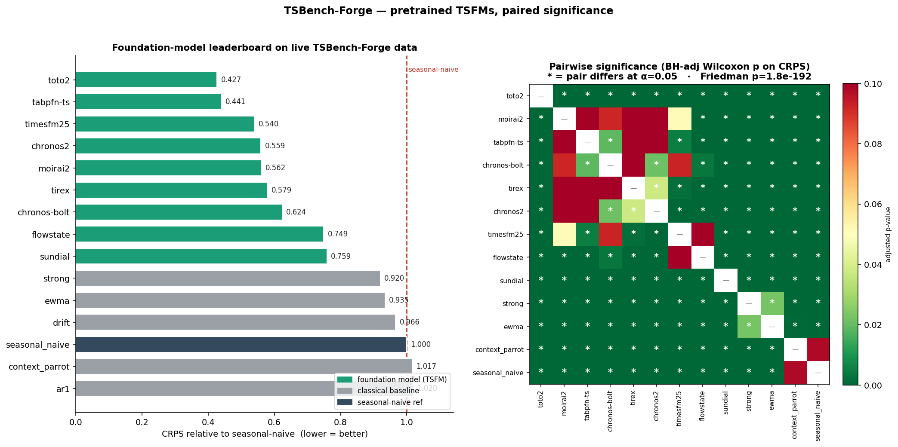

# The benchmark your foundation model hasn't memorized

*TSBench-Forge: scoring time-series foundation models on data that didn't exist when they were trained — and using an LLM agent to keep the data pool growing faster than it can go stale.*

---

## Time-series leaderboards look great. That's the problem.

Time-series foundation models (TSFMs) have had a spectacular two years. Chronos, TimesFM, Moirai, Toto, TiRex and friends post impressive zero-shot numbers on the standard suites: [GIFT-Eval](https://huggingface.co/datasets/Salesforce/GiftEval), [BOOM](https://huggingface.co/datasets/Datadog/BOOM), [TIME](https://huggingface.co/datasets/Real-TSF/TIME), and the older Monash / M-competition sets.

These are good benchmarks, built carefully by serious teams. But they share one structural weakness: **they are static snapshots**. Once a dataset is published, three things happen, in order:

1. **Contamination.** The datasets leak into pretraining corpora. LOTSA — the mix behind several major TSFMs — contains many of the classic evaluation sets outright. When a model "zero-shots" ETTh1 or the Electricity dataset, it may simply be remembering it. Nobody has to cheat for this to happen; web-scale scraping does it automatically.
2. **Benchmark-maxxing.** Even without literal leakage, a fixed test set invites optimization against its quirks. Architecture choices, tokenizers, and quantile heads get tuned until the suite saturates. The leaderboard keeps improving; the models may not be.
3. **Staleness.** The world's data-generating processes drift. A benchmark frozen in 2021 measures forecasting skill on 2021 dynamics.

The result is a familiar credibility gap: scores climb, but nobody is sure what they measure anymore.

## Our approach: score on data the model cannot have seen

TSBench-Forge takes the boring-but-honest route: **only forecast live data, scraped after every evaluated model's training cutoff.**

The benchmark is a catalog of (currently) 170+ real, verified time-series sources — energy grids, river gauges, earthquake feeds, crypto microstructure, hospital wait times, CDN incident streams, transit telemetry — each polled on its own cadence by a dumb, deterministic scraper. Challenges are sampled from the accumulated archive with a seeded RNG: a 256-step context window, a 48-step horizon, scored by CRPS and MASE **relative to seasonal-naive**, with paired Wilcoxon tests, Friedman tests, and Holm correction across the panel. If a model's edge isn't statistically real against the panel, the leaderboard says so.

Three design rules keep it honest:

- **Contamination by construction is impossible.** The forecast targets postdate every model's cutoff. There is nothing to memorize.
- **A deterministic quality gate, not vibes.** Every source must pass an automatic admission test (`--assess`): non-degenerate values, no flatlines or stuck sensors, and a *discrimination* check — the series must be neither pure noise (unforecastable) nor trivially solved by seasonal-naive. Sources that fail don't enter the pool, no matter how interesting they sound. This week the gate rejected Coinbase INTX funding rates (99% repeated values — a clamped, quantized series) while admitting Kraken's, and it was right both times.
- **Baselines that bite.** Seasonal-naive, EWMA, drift, AR(1), and a "context parrot" run alongside the TSFMs. A foundation model that can't separate itself from an exponential moving average has no business on a podium.

## The catch: a live benchmark must keep growing

A fixed catalog of live sources decays too — feeds die, get bot-walled, or drift into triviality. Curating new sources by hand is the bottleneck. So we automated the search, carefully.

**Autoresearch** is an LLM-driven discovery agent (`src/source_discovery/`) with a deliberately narrow job: it reads the catalog and the domain×cadence coverage gaps, and *proposes* candidate sources. Everything after the proposal is deterministic code: a metadata vet (schema, contamination denylist, duplicate detection against catalog and a persistent proposal ledger), a live probe from the actual scrape host, and finally the same data admission gate every source faces. The LLM never touches a score. A human merges the PR.

The ledger is what makes it compound: every proposal ever made — accepted, rejected, wired, or key-gated — is committed to the repo (1,004 entries and counting), and gets injected back into the agent's prompt. Early blind sweeps proposed Steam player counts 55 times; ledger-aware sweeps produce zero repeats and go progressively weirder — which is exactly where uncontaminated data lives.

This month's sweep, concretely:

- **100 rounds** of discovery (GLM via OpenRouter, ~35 seconds and a fraction of a cent per round)
- 1,295 proposals → **663 unique candidates** → 454 passed the metadata vet
- all 273 unique hosts live-probed: **118 confirmed live and keyless**
- 9 sources investigated end-to-end and wired — Gemini trade ticks (the catalog's first order-flow stream), NOAA Coral Reef Watch (41 years of daily reef SST), RIPE Atlas root-server RTTs, USACE reservoir gauges, Swiss lake sensors, Singapore's live taxi count, and more — with ~845k rows of historical backfill where the APIs allowed paging
- and, as a bonus, the admission tooling caught **three real data-loss bugs** in our own pipeline (a comma-only CSV parser silently shredding two sources; a panel dedup collapsing co-timestamped series; scheme-less URLs defeating duplicate detection). A benchmark that audits its own plumbing is worth the automation alone.

The nice failure mode: most rejected proposals are rejected *by code*, with reasons logged. The expensive human attention goes only to the shortlist.

## But is it measuring the same thing as the established suites?

A live benchmark would be useless if its series were exotic aliens. So we ran the [BOOM paper's §4.3](https://arxiv.org/abs/2505.14766) characterization: six classical features (lag-1 autocorrelation, ARCH effects, spectral entropy, trend/seasonal strength, Hurst) computed per series, PCA over the union of **TSBench-Forge (342 series), GIFT-Eval (354,444), TIME (6,633), and BOOM (32,712)**.

The result (PC1+PC2 = 72% of variance):

| benchmark | n series | spread (PC1–4) | centroid dist. to ours |
|---|--:|--:|--:|
| TSBench-Forge | 342 | 5.54 | — |
| GIFT-Eval | 354,444 | 7.86 | 0.49 |
| TIME | 6,633 | 5.86 | 1.57 |
| BOOM | 32,712 | 14.97 | 1.46 |

Our centroid sits essentially on top of GIFT-Eval's, and the median nearest-neighbor distance from every reference corpus to a TSBench-Forge point is 0.08–0.13 — the live pool occupies the *populated* regions of the shared character space, not an outlier island. Translation: **same kind of forecasting problems, minus the memorization**. (BOOM's enormous spread also shows where our headroom is: observability telemetry. The new RIPE Atlas latency source is the first deliberate step in that direction.)

## The leaderboard, on data nobody has seen

Nine TSFMs, one GPU pod, 256 seeded challenges over the expanded pool (11% of challenges drawn from the brand-new sources):

| rank | model | CRPS (rel. seasonal-naive) | MASE (rel.) |
|---:|---|--:|--:|
| 1 | **Toto-2** | 0.427 | 0.671 |
| 2 | **TabPFN-TS** | 0.441 | 0.621 |
| 3 | TimesFM-2.5 | 0.540 | 0.730 |
| 4 | Chronos-2 | 0.559 | 0.851 |
| 5 | Moirai-2 | 0.562 | 0.877 |
| 6 | TiRex | 0.579 | 0.883 |
| 7 | Chronos-Bolt | 0.624 | 0.972 |
| 8 | FlowState | 0.749 | 1.124 |
| 9 | Sundial | 0.759 | 1.111 |
| — | best classical baseline | 0.920 | 0.823 |

The headline findings:

- **The TSFM story survives contamination-free scoring.** All nine models beat seasonal-naive on CRPS with overwhelming significance (Friedman χ² = 1462.5, p ≈ 2×10⁻¹⁹²; every Holm-adjusted Wilcoxon p < 10⁻¹⁹). Zero-shot probabilistic forecasting on genuinely unseen data is real.
- **The edge is probabilistic.** On CRPS the sweep is total; on point accuracy (MASE) only the top models clearly beat tuned classical baselines. If you only need a point forecast, an EWMA remains embarrassingly competitive.
- **Harder data reshuffles the middle.** When the new sources entered the pool, absolute CRPS rose across the board — irregular trade ticks, RTT streams with failure sentinels, and reservoir guide-curves are harder targets than the classics — and the mid-table reordered (Moirai-2 jumped three places). The top two, Toto-2 and TabPFN-TS, held rank. Robustness to distribution drift is itself a finding, and it's one a static benchmark can't produce.
- **The gate keeps the floor honest.** AR(1), drift, and the context parrot remain statistically indistinguishable from seasonal-naive — the challenge pool neither rewards noise nor triviality.

## What we're *not* claiming

Honesty cuts both ways. The pool is 342 series against GIFT-Eval's 354k — breadth is our weakness, and challenges drawn from the same source are not independent (our significance tests are paired per-challenge partly for this reason). Sources have lifecycles: some of this month's additions are snapshot pollers whose history only accrues from activation, and one (Iowa's snow-plow fleet) is wired but disabled until winter gives it something to say. And a live benchmark is not reproducible in the archival sense — you can rerun the code, but the world will have moved. We consider that a feature; you may reasonably disagree.

## Takeaway

Static benchmarks answer "who best fit the published past?" A live, self-expanding benchmark answers the question practitioners actually have: **who forecasts the future best, on data nobody has seen, across dynamics that keep drifting?**

The whole loop — scraper, quality gates, discovery agent, ledger, significance harness — is open at [tensorlink-dev/TSBench-Forge](https://github.com/tensorlink-dev/TSBench-Forge). Propose a source; the vet is waiting.
